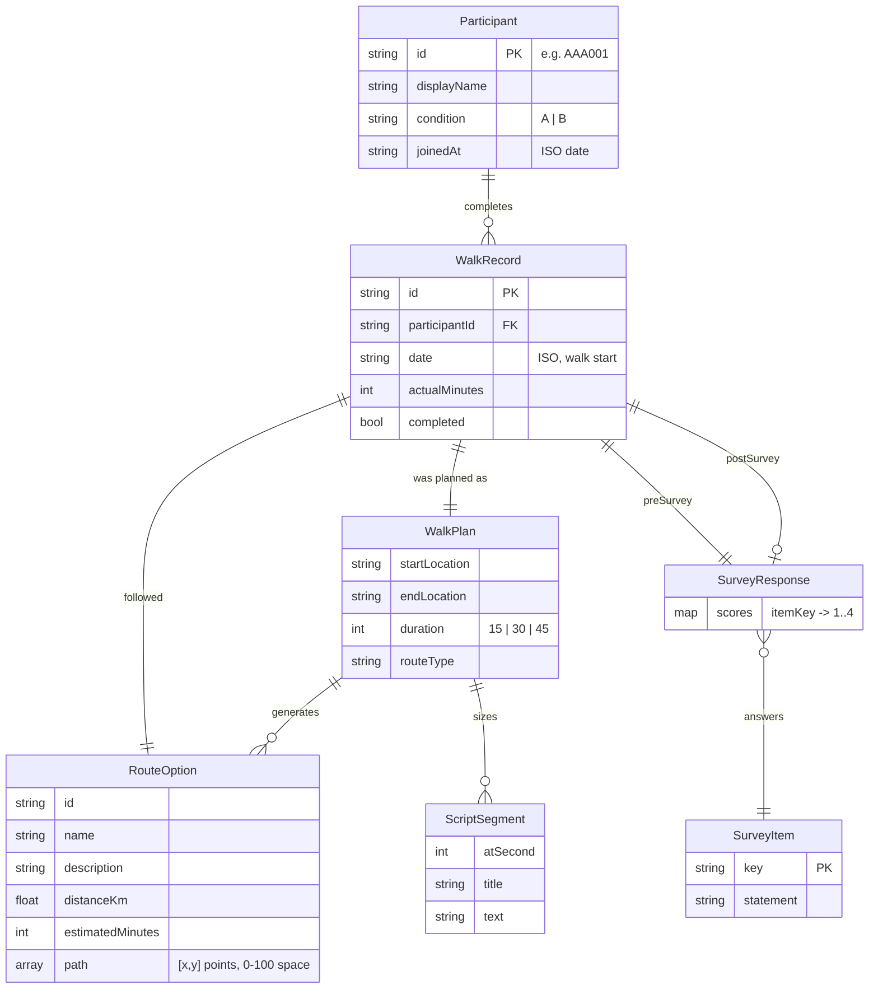
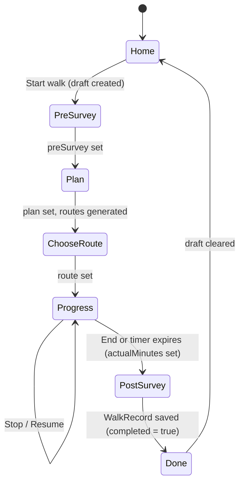

# Frontend domain model

This document describes the entities, relationships, and state the frontend works with. It is derived from [`frontend/src/types.ts`](../frontend/src/types.ts) and [`frontend/src/api/index.ts`](../frontend/src/api/index.ts); if those change, update this doc.

The model is deliberately the shape we expect the Python/MongoDB backend to expose, so the API layer can be swapped from mock data to real requests without changing components.

## Entities



### Participant

A trial participant. Identified by an anonymous ID (`AAA001` style) rather than a name; `displayName` is derived from it. `condition` is the experimental arm the participant was assigned to by an administrator (`A` or `B`); the frontend displays it but does not yet act on it.

| Field | Type | Notes |
|---|---|---|
| `id` | `string` | Primary key, also the login user ID |
| `displayName` | `string` | Shown on the home screen |
| `condition` | `'A' \| 'B'` | Set by admin; may become an open-ended string once conditions are admin-defined |
| `joinedAt` | ISO date string | |

### WalkRecord

One completed (or abandoned) guided walk. This is the unit of data the research dashboard will analyse: the pre/post surveys give the mood change, and `plan`, `route`, and `actualMinutes` give the dose.

| Field | Type | Notes |
|---|---|---|
| `id` | `string` | Generated client-side as `w-<timestamp>` for now; backend should assign |
| `participantId` | `string` | FK → Participant |
| `date` | ISO date string | When the walk flow started (the pre-survey), not when it finished |
| `plan` | `WalkPlan` | Embedded, see below |
| `route` | `RouteOption` | Embedded copy of the option chosen, so the record is self-contained even if route generation changes |
| `preSurvey` | `SurveyResponse` | Always present |
| `postSurvey` | `SurveyResponse \| null` | `null` if the participant abandoned before the post-survey |
| `actualMinutes` | `number` | Wall-clock minutes between "Begin walk" and "End" (or the timer expiring) |
| `completed` | `boolean` | `true` once the post-survey is submitted |

### WalkPlan

What the participant asked for. Value object embedded in `WalkRecord`.

| Field | Type | Values |
|---|---|---|
| `startLocation` | `string` | Free text for now; will become a geocoded place once a map provider exists |
| `endLocation` | `string` | Defaults to `startLocation` ("End where I started") |
| `duration` | `WalkDuration` | `15 \| 30 \| 45` minutes |
| `routeType` | `RouteType` | `loop \| out_and_back \| quiet_streets \| green_space` |

### RouteOption

One candidate route produced for a plan. Three are generated per plan; the participant picks one. `path` is a placeholder polyline in a 0–100 unit square used by the mock map and will be replaced by real geometry (e.g. GeoJSON LineString) when routing is real.

### SurveyItem and SurveyResponse

The mood check-in is a fixed list of statements answered on a 4-point scale. The same items are used before and after the walk so the delta is comparable.

- `SurveyItem` — `{ key, statement }`, e.g. `{ key: 'calm', statement: 'I feel calm' }`. Currently four items: `calm`, `tense`, `at_ease`, `worried`.
- `SurveyScore` — `1 | 2 | 3 | 4` = *Not at all / Somewhat / Moderately / Very much*.
- `SurveyResponse` — `Record<itemKey, SurveyScore>`. Stored as a flat map so adding an item doesn't require a schema migration.

The history screen derives a **calm score** (out of 16) by summing positive items and reverse-scoring negative ones (`tense`, `worried`). That calculation lives in the UI for now; the backend may want to own it.

### ScriptSegment

A timed chunk of the meditation script. `atSecond` is the offset from "Begin walk" at which the segment is spoken. Segments are generated from a template whose timings are fractions of the total duration, so the same script stretches over a 15- or 45-minute walk. Not persisted; regenerated per walk.

## Roles

```ts
type Role = 'participant' | 'medical_professional' | 'researcher'
```

Only `participant` has a real flow. `medical_professional` and `researcher` currently land on the same admin placeholder and have no `Participant` record. Expect this to grow into a `User` entity with a role field once the admin views exist.

## Client-side session state

Not persisted to the backend. Held in React context ([`SessionContext.tsx`](../frontend/src/context/SessionContext.tsx)) and mirrored to `sessionStorage` so a page refresh mid-walk doesn't lose progress.

```ts
interface SessionState {
  role: Role | null
  participant: Participant | null
  draft: WalkDraft | null      // the walk currently in progress, if any
}

interface WalkDraft {
  id: string
  startedAt: string
  preSurvey?: SurveyResponse   // set by Pre-survey screen
  plan?: WalkPlan              // set by Plan screen
  route?: RouteOption          // set by Choose-route screen
  actualMinutes?: number       // set by Progress screen on End
}
```

A `WalkDraft` is a `WalkRecord` under construction. Each screen in the walk flow fills in one field; the post-survey screen assembles the final `WalkRecord`, saves it, and the Done screen clears the draft. Route guards (`RequireParticipant`, `RequireDraft`) redirect if the state a screen needs isn't present.

## Walk lifecycle



Leaving the flow before Done (back button, logout) discards the draft; nothing is saved. If abandoned walks should be recorded (`completed = false`, `postSurvey = null`), that is a future change to the Progress screen.

## API contract (current mock)

All functions in `frontend/src/api/index.ts` are `async` and are the only place components fetch data. Each maps naturally to an HTTP endpoint.

| Function | Suggested endpoint | Notes |
|---|---|---|
| `login(role, userId, password)` → `{ role, participant }` | `POST /auth/login` | Should return a session token in the real implementation |
| `getWalkHistory(participantId)` → `WalkRecord[]` | `GET /participants/{id}/walks` | Newest first |
| `generateRoutes(duration)` → `RouteOption[]` | `POST /routes/generate` | Will need the full `WalkPlan` (locations, type) once routing is real |
| `getScript(durationMinutes)` → `ScriptSegment[]` | `GET /scripts?duration=` | May become condition-dependent (different scripts per arm) |
| `saveWalk(record)` → `WalkRecord` | `POST /walks` | Backend should assign `id` and validate `participantId` against the session |

## Suggested MongoDB collections

A starting point for the backend, mirroring the entities above:

- `participants` — one document per `Participant`, plus auth fields (password hash, access code).
- `walks` — one document per `WalkRecord`, with `plan`, `route`, `preSurvey`, `postSurvey` embedded. Index on `participantId` and `date`.
- `conditions` — admin-defined experimental arms (name, description, script variant). Referenced by `participants.condition`.
- `surveyItems` — optional; only needed if items should be editable by admins rather than fixed in code.

## Open questions

- Should abandoned walks be saved? (Affects `completed` / `postSurvey: null`.)
- Will conditions change the script, the survey, or both? Determines whether `getScript` needs the participant's condition.
- Real route geometry format (GeoJSON vs. provider-specific) — decide when the map provider is chosen.
- Who owns the calm-score calculation: frontend, backend, or analysis-time only?
