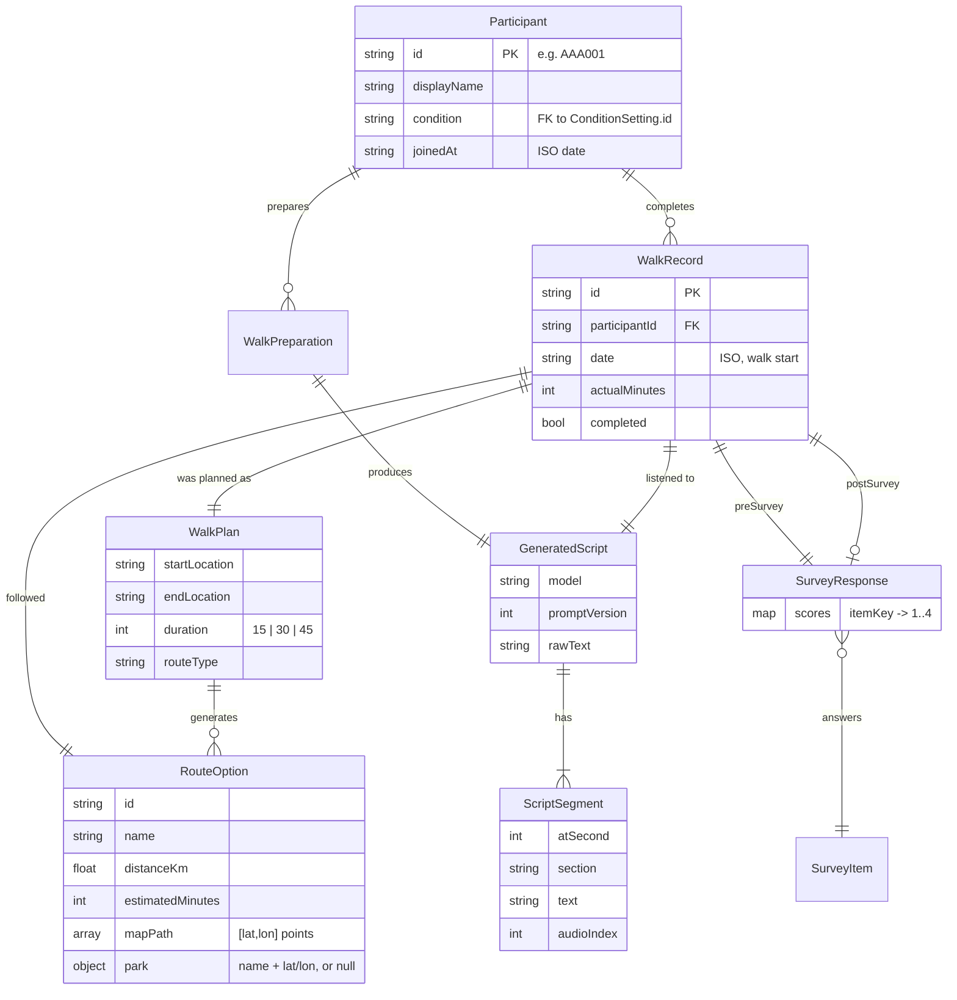
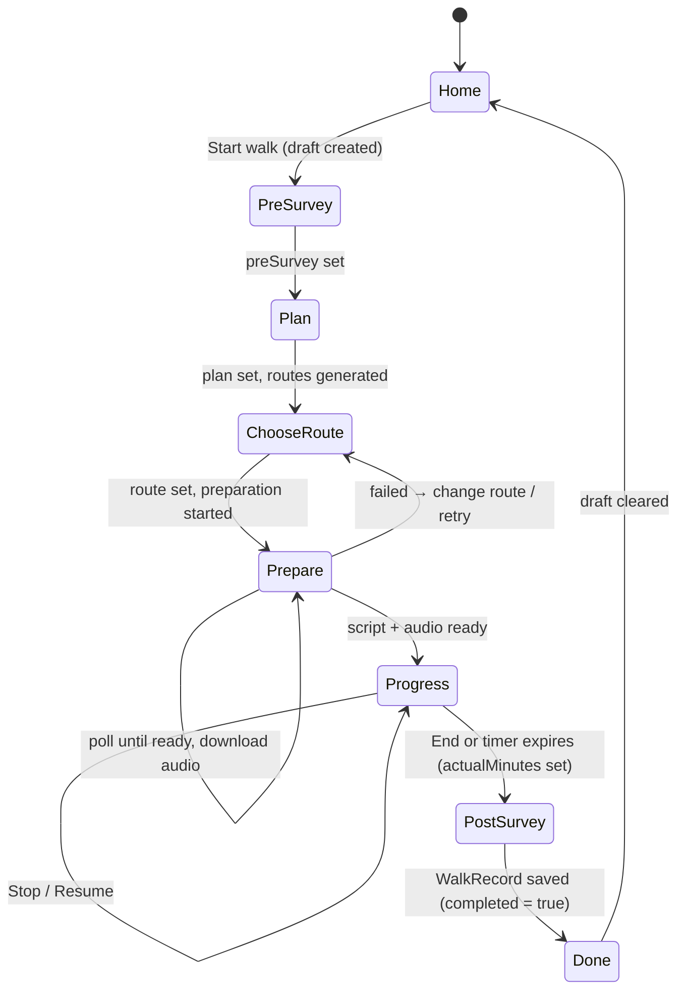

# Frontend domain model

This document describes the entities, relationships, and state the frontend works with. The types themselves live in [`shared/types.ts`](../shared/types.ts), imported by both the frontend and the backend; if they change, update this doc. The request/response contract is in [backend-api-spec.md](backend-api-spec.md).

## Entities



### Participant

A trial participant. Identified by an anonymous ID (`AAA001` style); `displayName` is derived from it. `condition` is the experimental arm an administrator assigned at creation; it decides the **voice** that reads the participant's scripts. Participants hold **no personal or clinical data**.

### WalkRecord

One completed guided walk: the unit of data the research dashboard analyses. The pre/post surveys give the mood change; `plan`, `route` and `actualMinutes` give the dose; `script` is the exact meditation text that was read (see below). `id` is assigned by the backend; the client's draft id is sent as `clientId` so a retried save cannot create a duplicate. Returned records also carry `scores`, computed by the backend.

### WalkPlan

What the participant asked for: `startLocation` (an address, or "Current location" with `startCoordinates` set), `endLocation`, `duration` (15 | 30 | 45) and `routeType`.

### RouteOption

One candidate route from `POST /routes/generate`: the direct walk, or a detour via a park (`park` set) that still fits the duration. `mapPath` is real geometry (`[latitude, longitude]` points) drawn on the Leaflet map; `path` is the same shape squashed into a 0–100 square for the fallback drawing; `origin`/`destination` are the coordinates the script generator needs.

### GeneratedScript and ScriptSegment

**Every walk gets its own meditation, written by AI for that walk** (route, weather, elevation, park or not, time budget) and read in the voice of the participant's condition. There is no fixed script anywhere in the system and no way to upload one (decision 2026-09-13).

A `GeneratedScript` records how it was made (`model`, `promptVersion`, `context`, `voice`) and the full `rawText`, plus `segments`: short spoken chunks, each with a `section` (`focused_attention` → `compassion` → `closing`), an `atSecond` offset from "Begin walk", and an `audioIndex` pointing at its mp3. The script is generated **before** the walk (see WalkPreparation) and copied onto the `WalkRecord` when the walk is saved.

### WalkPreparation

The server-side job that produces a walk's script and audio. Created when the participant confirms a route; the app polls its `status` (`pending → generating_script → generating_audio → ready | failed`) and `progress`, then downloads each segment's audio so the walk does not depend on the network.

### SurveyItem and SurveyResponse

Fixed list of statements answered on a 4-point scale, the same before and after the walk. Four items (`calm`, `tense`, `at_ease`, `worried`), defined in [`shared/survey.ts`](../shared/survey.ts). The **calm score** (out of 16) is computed by the backend and only displayed by the app.

## Roles

```ts
type Role = 'participant' | 'medical_professional' | 'researcher'
```

`participant` uses the walk flow. `medical_professional` and `researcher` land on the admin dashboard and are currently indistinguishable in what they can do.

## Admin entities

- **ConditionSetting** `{ id, name, voice, age }`: an experimental arm as edited on the Settings screen. Changes the text-to-speech voice (Male / Female / Neutral or a speaker name) and the apparent age of the guide. Nothing else.
- **AdminParticipantItem**: one row of `GET /admin/participants`: `id`, `condition`, `status`, `walkCount`, `lastWalkAt`, `latestScores`, `active`.
- **CreateParticipantResult**: the new `AdminParticipantItem` plus the single-use `accessCode`, shown exactly once.

## Client-side session state

Held in React context ([`SessionContext.tsx`](../frontend/src/context/SessionContext.tsx)) and mirrored to `sessionStorage` so a refresh mid-walk doesn't lose progress. The JWT lives here too; the API layer attaches it to every request and signs the session out on a 401.

```ts
interface SessionState {
  token: string | null
  expiresAt: string | null
  role: Role | null
  participant: Participant | null
  draft: WalkDraft | null      // the walk currently in progress, if any
}

interface WalkDraft {
  id: string                   // becomes the walk's clientId
  startedAt: string
  preSurvey?: SurveyResponse   // Pre-survey screen
  plan?: WalkPlan              // Plan screen
  route?: RouteOption          // Choose-route screen
  preparationId?: string       // Prepare screen, once generation has started
  script?: GeneratedScript     // Prepare screen, once ready
  actualMinutes?: number       // Progress screen on End
}
```

Downloaded audio is kept in memory only (`frontend/src/api/audioCache.ts`); the Progress screen re-downloads it after a reload.

## Walk lifecycle



**Abandoned walks are not saved.** Leaving the flow before Done discards the draft; nothing reaches the backend except the preparation, which is harmless.

## API layer

All functions in [`frontend/src/api/index.ts`](../frontend/src/api/index.ts) are the only place components fetch data. There is no mock layer: the app always talks to the backend (`VITE_API_BASE_URL`).

| Function | Endpoint |
|---|---|
| `login(role, userId, password)` | `POST /auth/login` |
| `redeemAccessCode(userId, code, password)` | `POST /auth/access-code` |
| `getMe()` | `GET /me` |
| `getWalkHistory()` | `GET /me/walks` |
| `generateRoutes(plan)` | `POST /routes/generate` |
| `prepareWalk(plan, route)` / `getPreparation(id)` / `getSegmentAudio(id, i)` | `POST /me/walks/prepare`, `GET /me/walks/prepare/{id}`, `GET …/audio/{i}` |
| `saveWalk(input)` | `POST /me/walks` |
| `getAdminConditions()` / `saveAdminConditions(list)` | `GET` / `PUT /admin/conditions` |
| `getAdminParticipants()` / `createAdminParticipant(conditionId)` | `GET` / `POST /admin/participants` |
| `getAdminExportCsv()` | `GET /admin/export.csv` |

## Decisions

| Question | Decision | Date |
|---|---|---|
| Save abandoned walks? | No. Only walks with both surveys are recorded. | 2026-09-05 |
| Who owns the calm-score calculation? | Backend defines and returns it; frontend displays only. | 2026-09-05 |
| Fixed script per condition or AI-generated per walk? | **AI-generated per walk, always.** No script upload or editing anywhere. A condition changes only the voice. The exact text is stored on each walk. | 2026-09-13 |
| Browser speech synthesis or server-generated audio? | **Server-generated** (Google Cloud Text-to-Speech via the AI service) with a slow, soft delivery (lower speaking rate and pitch); the browser voice was not soothing enough. | 2026-09-13 |
| One server or two? | One front door: the app talks only to the Node API, which calls the Python AI service internally. Both run as one Compose unit. | 2026-09-13 |
| Mock data in the frontend? | Removed. The app always uses the real API. | 2026-09-13 |
