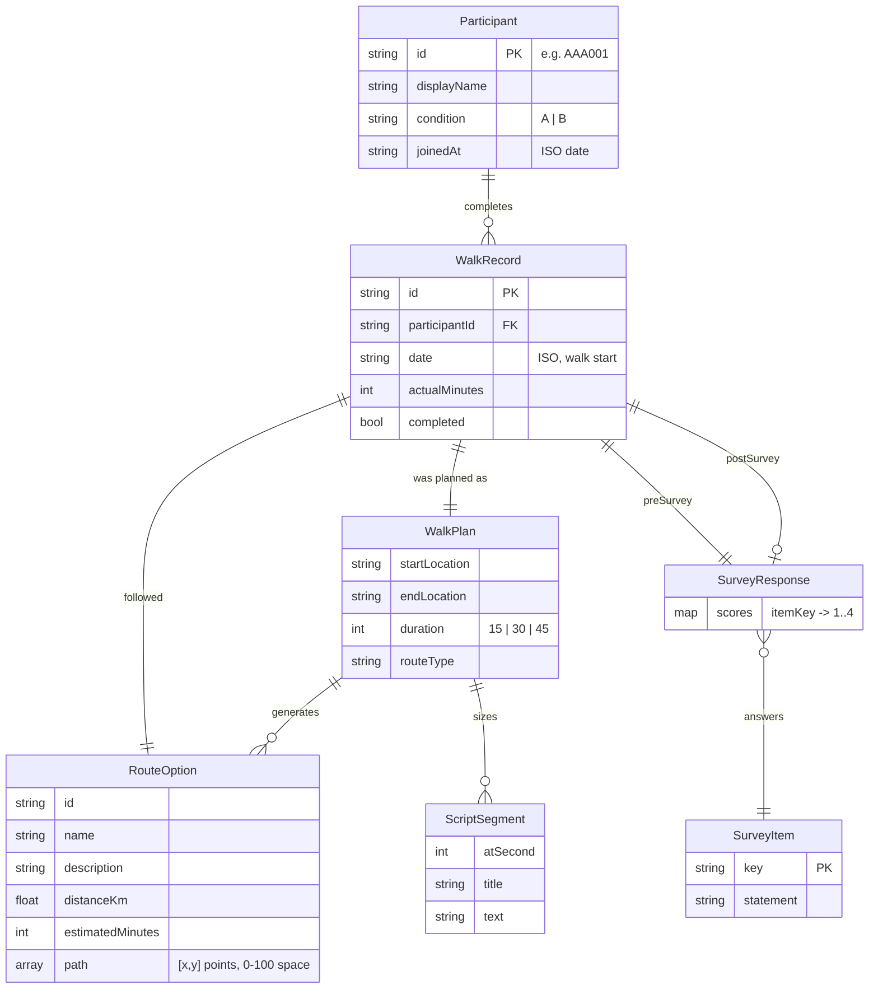
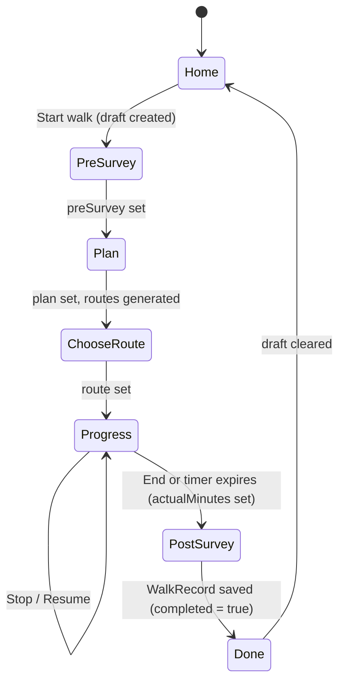

# Frontend domain model

This document describes the entities, relationships, and state the frontend works with. It is derived from [`frontend/src/types.ts`](../frontend/src/types.ts) and [`frontend/src/api/index.ts`](../frontend/src/api/index.ts); if those change, update this doc.

The model is deliberately the shape we expect the Python/MongoDB backend to expose, so the API layer can be swapped from mock data to real requests without changing components.

## Entities



### Participant

A trial participant. Identified by an anonymous ID (`AAA001` style) rather than a name; `displayName` is derived from it. `condition` is the experimental arm the participant was assigned to by an administrator (`A` or `B`); the frontend displays it but does not yet act on it.

| Field | Type | Notes |
|---|---|---|
| `id` | `string` | Primary key, also the login user ID |
| `displayName` | `string` | Shown on the home screen |
| `condition` | `'A' \| 'B'` | Set by admin; may become an open-ended string once conditions are admin-defined |
| `joinedAt` | ISO date string | |

### WalkRecord

One completed (or abandoned) guided walk. This is the unit of data the research dashboard will analyse: the pre/post surveys give the mood change, and `plan`, `route`, and `actualMinutes` give the dose.

| Field | Type | Notes |
|---|---|---|
| `id` | `string` | Generated client-side as `w-<timestamp>` for now; backend should assign |
| `participantId` | `string` | FK → Participant |
| `date` | ISO date string | When the walk flow started (the pre-survey), not when it finished |
| `plan` | `WalkPlan` | Embedded, see below |
| `route` | `RouteOption` | Embedded copy of the option chosen, so the record is self-contained even if route generation changes |
| `preSurvey` | `SurveyResponse` | Always present |
| `postSurvey` | `SurveyResponse \| null` | `null` if the participant abandoned before the post-survey |
| `actualMinutes` | `number` | Wall-clock minutes between "Begin walk" and "End" (or the timer expiring) |
| `completed` | `boolean` | `true` once the post-survey is submitted |

### WalkPlan

What the participant asked for. Value object embedded in `WalkRecord`.

| Field | Type | Values |
|---|---|---|
| `startLocation` | `string` | Free text for now; will become a geocoded place once a map provider exists |
| `endLocation` | `string` | Defaults to `startLocation` ("End where I started") |
| `duration` | `WalkDuration` | `15 \| 30 \| 45` minutes |
| `routeType` | `RouteType` | `loop \| out_and_back \| quiet_streets \| green_space` |

### RouteOption

One candidate route produced for a plan. Three are generated per plan; the participant picks one. `path` is a placeholder polyline in a 0–100 unit square used by the mock map and will be replaced by real geometry (e.g. GeoJSON LineString) when routing is real.

### SurveyItem and SurveyResponse

The mood check-in is a fixed list of statements answered on a 4-point scale. The same items are used before and after the walk so the delta is comparable.

- `SurveyItem` — `{ key, statement }`, e.g. `{ key: 'calm', statement: 'I feel calm' }`. Currently four items: `calm`, `tense`, `at_ease`, `worried`.
- `SurveyScore` — `1 | 2 | 3 | 4` = *Not at all / Somewhat / Moderately / Very much*.
- `SurveyResponse` — `Record<itemKey, SurveyScore>`. Stored as a flat map so adding an item doesn't require a schema migration.

The history screen shows a **calm score** (out of 16): the sum of positive items plus reverse-scored negative ones (`tense`, `worried`). See [Derived scores](#derived-scores) for where this calculation should live.

### ScriptSegment

A timed chunk of the meditation script. `atSecond` is the offset from "Begin walk" at which the segment is spoken. Segments are generated from a template whose timings are fractions of the total duration, so the same script stretches over a 15- or 45-minute walk. Not persisted; regenerated per walk.

**The script depends on the participant's condition.** Each experimental arm has its own script, so script retrieval takes the condition as input (see the API contract). The mock currently has a single script; the condition-specific variants are a backend/admin concern. Because a walk's condition is fixed by the participant, `WalkRecord` doesn't need to store the script — but if scripts can be edited over time, store a `scriptVersion` on the record so analysis knows which text was read.

## Roles

```ts
type Role = 'participant' | 'medical_professional' | 'researcher'
```

Only `participant` has a real flow. `medical_professional` and `researcher` currently land on the same admin placeholder and have no `Participant` record. Expect this to grow into a `User` entity with a role field once the admin views exist.

## Client-side session state

Not persisted to the backend. Held in React context ([`SessionContext.tsx`](../frontend/src/context/SessionContext.tsx)) and mirrored to `sessionStorage` so a page refresh mid-walk doesn't lose progress.

```ts
interface SessionState {
  role: Role | null
  participant: Participant | null
  draft: WalkDraft | null      // the walk currently in progress, if any
}

interface WalkDraft {
  id: string
  startedAt: string
  preSurvey?: SurveyResponse   // set by Pre-survey screen
  plan?: WalkPlan              // set by Plan screen
  route?: RouteOption          // set by Choose-route screen
  actualMinutes?: number       // set by Progress screen on End
}
```

A `WalkDraft` is a `WalkRecord` under construction. Each screen in the walk flow fills in one field; the post-survey screen assembles the final `WalkRecord`, saves it, and the Done screen clears the draft. Route guards (`RequireParticipant`, `RequireDraft`) redirect if the state a screen needs isn't present.

## Walk lifecycle



**Abandoned walks are not saved.** Leaving the flow before Done (back button, logout, closing the tab) discards the draft; nothing reaches the backend. Only walks with both surveys are recorded. Consequently `WalkRecord.completed` is always `true` and `postSurvey` is never `null` in practice; both fields are kept so the backend has room to change this later without a breaking change.

## API contract (current mock)

All functions in `frontend/src/api/index.ts` are `async` and are the only place components fetch data. Each maps naturally to an HTTP endpoint; the full request/response contract is in [backend-api-spec.md](backend-api-spec.md).

| Function | Suggested endpoint | Notes |
|---|---|---|
| `login(role, userId, password)` → `{ role, participant }` | `POST /auth/login` | Should return a session token in the real implementation |
| `getWalkHistory(participantId)` → `WalkRecord[]` | `GET /participants/{id}/walks` | Newest first |
| `generateRoutes(duration)` → `RouteOption[]` | `POST /routes/generate` | Will need the full `WalkPlan` (locations, type) once routing is real |
| `getScript(durationMinutes)` → `ScriptSegment[]` | `GET /scripts?condition=A&duration=15` | Scripts differ per condition. The backend should resolve the condition from the session rather than trusting a query param, so the frontend can't request the wrong arm's script |
| `saveWalk(record)` → `WalkRecord` | `POST /walks` | Backend should assign `id` and validate `participantId` against the session |

## Derived scores

The calm score (and any future aggregate) is *derived* from raw survey answers. Best practice for research data:

1. **Store only the raw answers.** `SurveyResponse` is the source of truth. Never store a computed score in the database as if it were an observation — if the scoring rule changes (e.g. a new item is added or an item is re-weighted), stored scores would silently disagree with the raw data.
2. **Define the scoring rule once, on the backend.** Put the calculation in the Python API and return it alongside the record (e.g. `WalkRecord.scores.calm`). One definition means the participant app, the researcher dashboard, and the CSV export all agree. Version the rule (`scoringVersion: 1`) so old exports can be reproduced.
3. **The frontend only displays.** The current implementation in [`History.tsx`](../frontend/src/pages/History.tsx) computes the score client-side because there is no backend yet. Treat that as a placeholder: once the API returns scores, delete the client-side calculation rather than keeping two copies.

For the research analysis itself (statistical comparison of conditions), do that offline from the raw export, not in the app — the app's score is for participant feedback, not for the paper.

## Suggested MongoDB collections

A starting point for the backend, mirroring the entities above:

- `participants` — one document per `Participant`, plus auth fields (password hash, access code).
- `walks` — one document per `WalkRecord`, with `plan`, `route`, `preSurvey`, `postSurvey` embedded. Index on `participantId` and `date`.
- `conditions` — admin-defined experimental arms (name, description, and the script segments for that arm). Referenced by `participants.condition`.
- `surveyItems` — optional; only needed if items should be editable by admins rather than fixed in code.

## Decisions

| Question | Decision | Date |
|---|---|---|
| Save abandoned walks? | No. Only walks with both surveys are recorded. | 2026-09-05 |
| What does a condition change? | The meditation script. Survey items are the same for all conditions. | 2026-09-05 |
| Who owns the calm-score calculation? | Backend defines and returns it; frontend displays only. See [Derived scores](#derived-scores). | 2026-09-05 |

## Open questions

- Real route geometry format (GeoJSON vs. provider-specific) — decide when the map provider is chosen.
- Should the script text be versioned on each `WalkRecord` (`scriptVersion`) so edits to a condition's script don't muddy earlier data?
